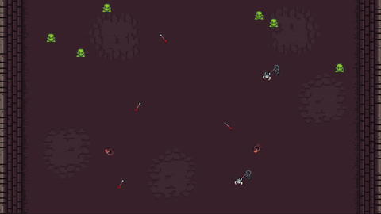

<p align="center"></p>

# MARL with Knights, Archers, Zombies (KAZ)

This project explores the impact of different reward shaping techniques on multi-agent reinforcement learning (MARL) performance in the PettingZoo's Knights, Archers, Zombies (KAZ) environment. It compares baseline rewards against various shaping strategies using Proximal Policy Optimization (PPO) from Stable Baselines3.

## Overview

The KAZ environment features cooperative agents (knights and archers) defending against a wave of zombies. This project implements and evaluates several reward shaping approaches to improve learning efficiency and final performance.

### Reward Shaping Strategies

1. **Base Reward**: Standard environment rewards only
2. **Proximity Shaping**: Rewards knights for approaching zombies
3. **Bottom Safety Shaping**: Rewards/Penalizes based on zombie proximity to the bottom of the screen
4. **Mixed Shaping**: Combination of proximity and safety shaping with temporal scheduling

## Features

- Multi-run experiments with statistical analysis and plotting
- Custom reward shaping wrapper
- Visualization of trained agents

## Installation

### Prerequisites

- Python 3.8+
- pip

### Dependencies

Install the required packages:

```bash
pip install numpy matplotlib supersuit stable-baselines3 pettingzoo
```

## Usage

### Running Experiments

Execute the main training:

```bash
python reward-shaping-comparison.py train
```

This will train agents under all defined reward shaping scenarios, saving logs and models in `RShaping_<parallel_envs>x<runs>x<timesteps>/` directories.

### Plotting Results
To generate plots from the training logs:

```bash
python reward-shaping-comparison.py plot
# or
python reward-shaping-comparison.py plot --individual
```

### Playing a Trained Model
To visually play a trained model:
```bash
python reward-shaping-comparison.py play
```

Which will prompt the user to select a scenario and run a trained model visually.

### Configuration

Key parameters in `reward-shaping-comparison.py`:

- `TOTAL_TIMESTEPS`: Total training steps per run
- `N_RUNS_PER_SCENARIO`: Number of random seeds per scenario
- `PARALLEL_ENVS`: Number of parallel environments
- `SCENARIOS`: List of reward shaping strategies to evaluate

### Custom Reward Shaping

Modify `reward_shaping.py` to implement new shaping functions. Each function should follow the signature:

```python
def custom_shaping(obs, agent, rewards, infos, **kwargs):
    # obs: agent observations
    # agent: agent name (e.g., 'knight_0')
    # rewards: current step rewards
    # infos: additional environment info
    # kwargs: shaping parameters
    return shaped_reward
```

## References

- [PettingZoo KAZ Environment](https://pettingzoo.farama.org/environments/butterfly/knights_archers_zombies/)
- [Stable Baselines3](https://stable-baselines3.readthedocs.io/)